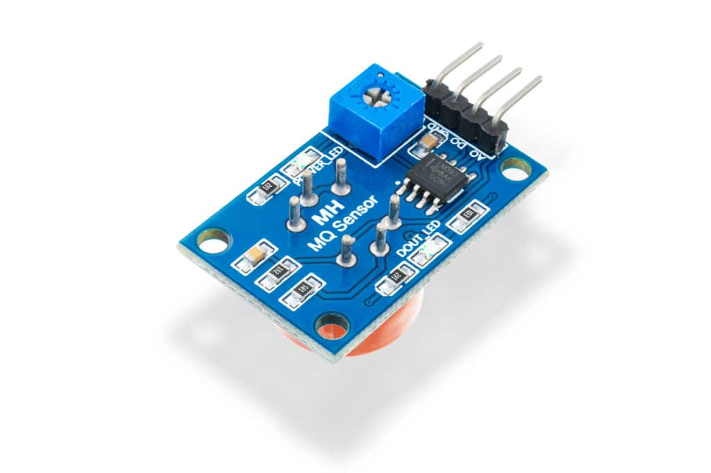
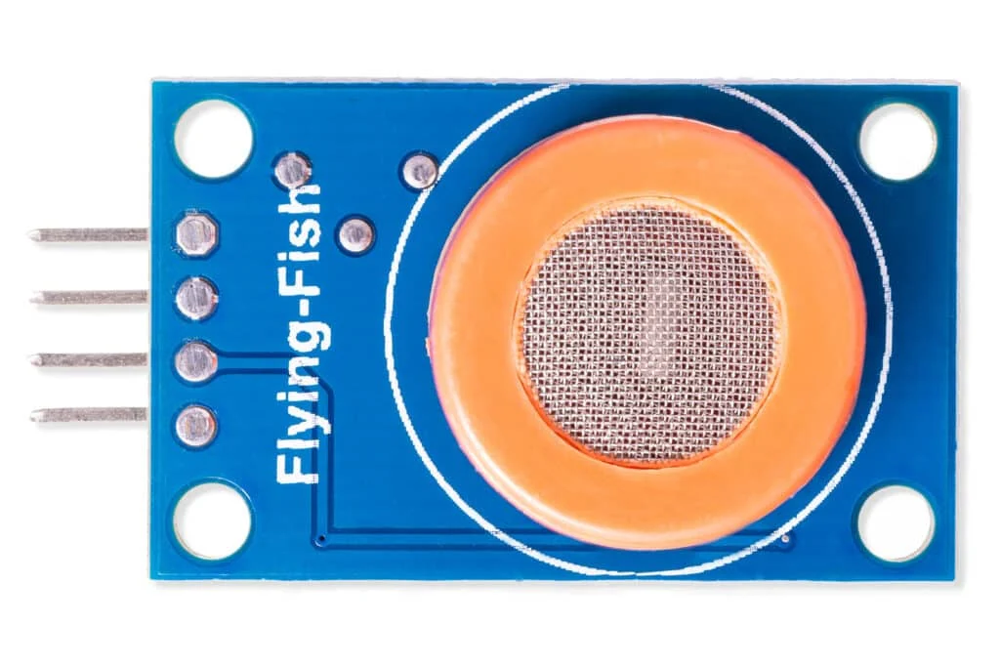
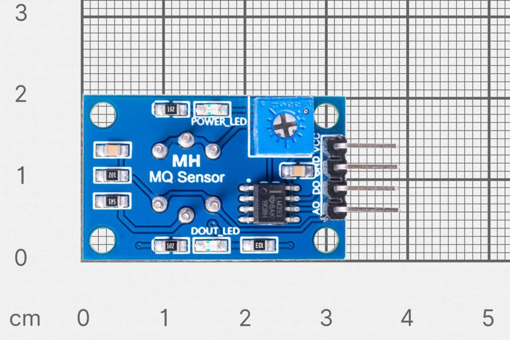
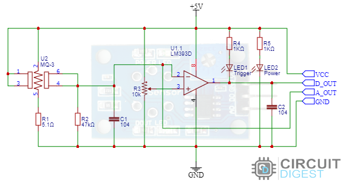
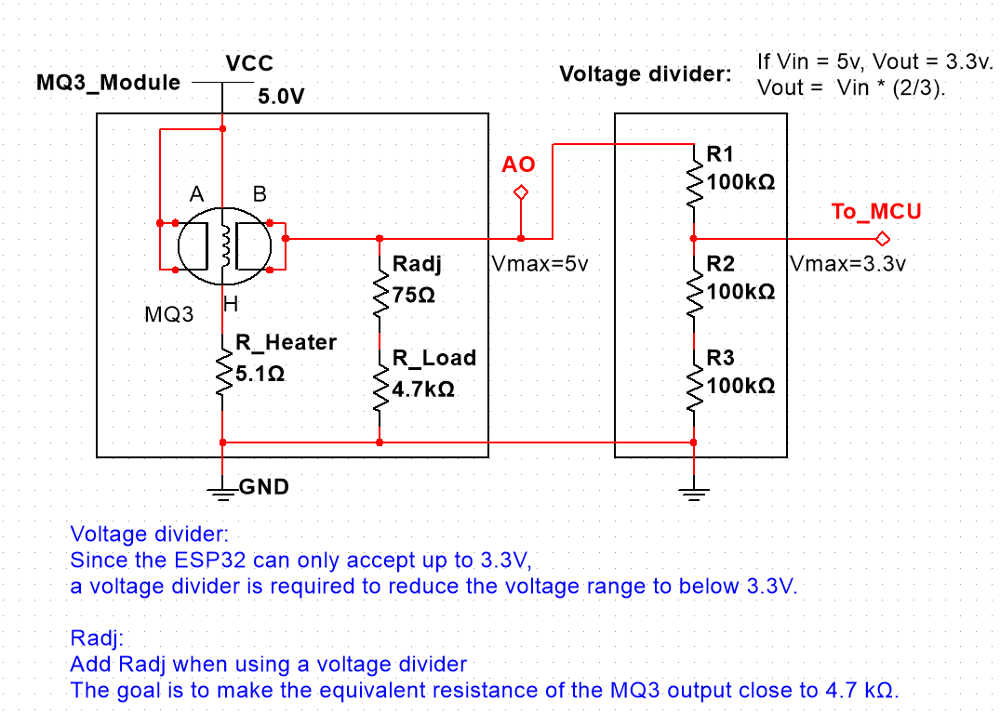
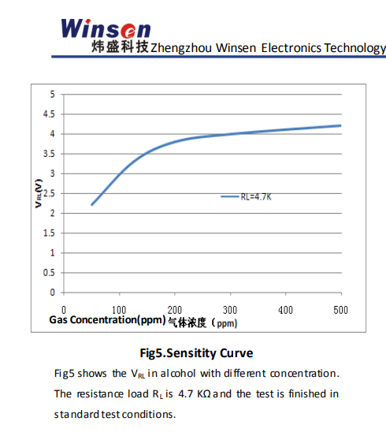
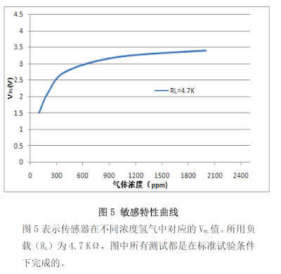
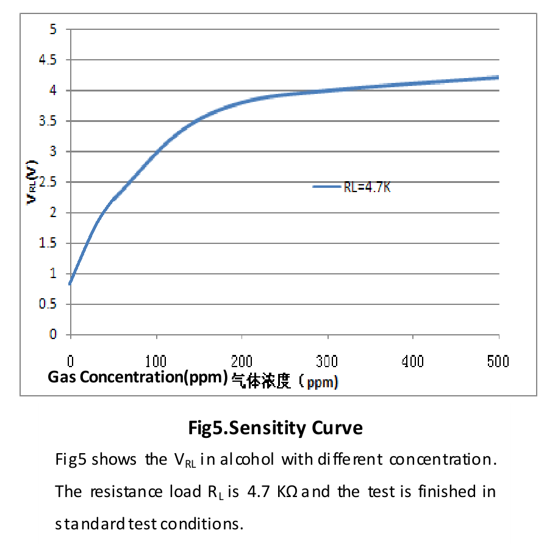
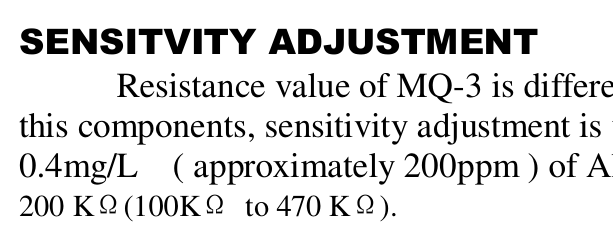
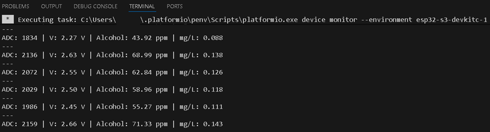

# MQ-3 alcohol sensor on the ESP32-S3

Reads an MQ-3 alcohol sensor with an ESP32-S3 and prints the alcohol level in ppm and mg/L. Two things needed some care:

1. The sensor module runs at 5 V, but the ESP32 ADC only takes 3.3 V.
2. The sensitivity curve in the datasheet is only valid with a 4.7 kΩ load resistor, and the voltage divider changes that.

Hardware: ESP32-S3-DevKitC-1U-N8R8 (8 MB flash, 8 MB PSRAM) and an MQ-3 module.









## Voltage divider

The 0-5 V analog output goes through a divider before it reaches GPIO 1:

- R1 (to the sensor): 100 kΩ
- R2 (to ground): 200 kΩ, made of two 100 kΩ in series

$$V_{GPIO} = V_{MQ3} \times \frac{R2}{R1 + R2} = V_{MQ3} \times \frac{200k}{300k} \approx 0.66 \times V_{MQ3}$$

So 5.0 V from the sensor becomes about 3.33 V at the ESP32.

## Keeping the load resistor at 4.7 kΩ

The sensitivity curve assumes a load resistor ($R_L$) of 4.7 kΩ. The 300 kΩ divider sits in parallel with the module's own $R_L$ and lowers it. To get 4.7 kΩ in total, the module's resistor has to be a bit larger:

$$R_{board} = \frac{R_{EQ} \times R_{DIV}}{R_{DIV} - R_{EQ}} = \frac{4700 \times 300000}{295300} \approx 4775\Omega$$

I replaced the SMD resistor on the module with 4.7 kΩ + 75 Ω in series.

```text
       MQ-3 Sensor Module
      +------------------+
      |                  |
      |       [VCC] -----+-----> 5V Source
      |                  |
      |       [GND] -----+-----> GND
      |                  |
      |       [A0]       |
      +--------+---------+
               |
               | <--- Analog Signal (0-5V)
               |
      (Note: On-board RL modified to 4.7kΩ + 75Ω)
               |
               +-----------------------+
                                       |
                                    [100kΩ]  <-- R_Divider_Top
                                       |
ESP32-S3 GPIO 1 <----------------------+
(Max 3.33V)                            |
                                    [100kΩ]  \
                                       |      } R_Divider_Bottom (Total 200kΩ)
                                    [100kΩ]  /
                                       |
                                      GND
```



## Calibration

1. The datasheet curve (Fig. 5) stops at 50 ppm, so I extended it by hand down to clean air (0 ppm). With the 4.7 kΩ load that gives about 0.8 V.
2. I read the points off the log-scale plot with WebPlotDigitizer.
3. A regression on those points gives the formula from voltage to ppm:

$$PPM = e^{\left(\frac{V_{RL} + 1.53338}{0.95387}\right)} - 9.84144$$

The data, the WebPlotDigitizer project and the fitting script are in `MQ3_Sensitity_Curve_Analysis/`.




Curve from the [Winsen MQ-3B datasheet](https://www.winsen-sensor.com/product/mq-3b.html), and the same curve extended by hand:



For mg/L the datasheet gives a straight conversion: 1 mg/L = 500 ppm.



## The program

`src/main.cpp` averages 100 ADC readings, undoes the divider (x 1.5, plus a 0.05 V offset), converts to ppm and mg/L and prints a line every 2 seconds:



`platformio.ini` is set up for the N8R8 board (octal PSRAM, 80 MHz flash, default 8 MB partitions).

Kept for reference in `src/`: `V-RL_to_ppm.txt` (Python check of the regression formula) and `MQ-3_mg-per-L.txt` (an earlier version with a simple straight-line formula, less accurate).

## Other files

- `MQ3_sensor_documents/` - datasheets of the sensor and the module, and a Multisim 14 simulation of the module
- `images/` - the pictures used here
